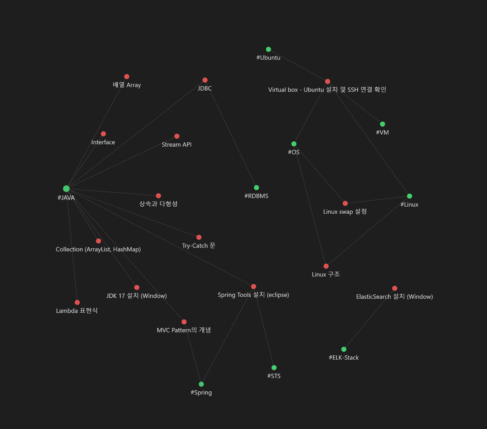
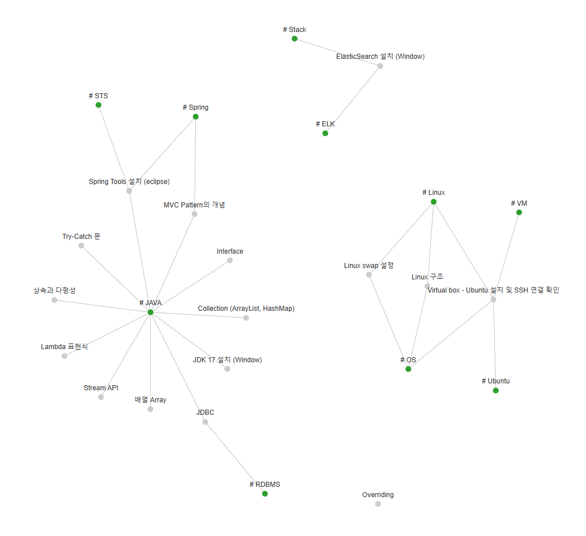

# Notes In Graph View
<br>
<br>
<br>
<br>

<div align=center>

### 이 프로젝트는 `Obsidian`에서 지원하는 `Graph View` 기능에 영감을 받아 제작되었습니다. 
자유롭게 사용 하셔도 무관합니다!

</div>


<br>
<br>
<br>
<br>


# 목차
[1. Overview](#overview) <br>
[2. Purpose](#purpose) <br>
[3. How to use](#how-to-use) <br>
[4. Tag Standard](#tag-standard) <br>


<br>
<br>
<br>
<br>


# Overview


| Obsidian | This Project |
| :--: | :--: |
|  |  |


> 개발 공부에 대한 리뷰는 `velog`에, 프로젝트는 `github`, 필기는 `obsidian`에 기록했을 때 과거에 공부 했던 내용에 대해 쉽게 접근하기 어려운 점을 감안해서 md 확장자로 정리한 내용에 한해 graph view를 보여주는 페이지를 제공하고자 이 프로젝트를 시작하게 되었습니다.


<br>
<br>
<br>
<br>


# Purpose
✅ git action을 통한 배포 자동화 <br>
✅ D3 js를 이용한 데이터 시각화 <br>


<br>
<br>
<br>
<br>


# How to use
## 1. Github Repository 준비
이 프로젝트에는 **총 두개의 github public 리포지토리가 필요** 합니다. 각각의 리포지토리의 역할은 다음과 같습니다.
1. `md-repo` : 노출시킬 md 확장자 파일들을 업로드, graph view에 필요한 노드 및 간선 정보 업데이트
2. `page-repo` : graph view가 보여지는 page를 제공


<br>
<br>


## 2. `md-repo`에 git action 추가
> `workflows` 내에 있는 `GraphView.yml`과 `GraphView.js` 를 `md-repo/.github/workflows/` 경로에 추가

`GraphView.yml`, `GraphView.js` 파일은 `md-repo`에 `push`가 일어 났을 때 자동적으로 노드와 간선 정보를 담은 `graphView.json`을 생성합니다.


### 생성된 `graphView.json` 예시

```json
{
  "nodes": [
    {
      "id": 0,
      "filename": "Collection (ArrayList, HashMap)",
      "path": "Collection (ArrayList, HashMap)/Collection (ArrayList, HashMap).md",
      "group": 1
    },
    {
      "id": 1,
      "filename": "JAVA",
      "group": 2
    },
  ],
  "links": [
    {
      "source": 1,
      "target": 0,
      "value": 1
    },
  ]
}
```

> 예시에서 `node.group == 1`은 `.md` 파일을, `node.group == 2`는 `.md` 파일 내에 작성된 태그를 의미 합니다. 


<br>
<br>


## 2. `page-repo`에 git action 추가
> `workflows` 내에 있는 `static.yml`과 `page-repo/.github/workflows/` 경로에, `src` 내에 있는 `index.html`을 `page-repo/src/` 경로에 추가

`static.yml`은 `page-repo`에 `push`가 일어났을 때 `src/`에 위치한 `static`파일들을 페이지로 배포합니다. 여기서 `static`은 `D3 js`를 이용하여 구현한 `html` 파일입니다.

### `index.html` 수정할 위치는 다음과 같습니다.

```html
<head>
    <!-- 중략 -->
    <title>dyoun12's Notes</title> <!-- 원하는 내용으로 수정해주세요. -->
    <!-- 중략 -->
</head>
```

```html
<script>
    // 중략
    const owner = "dyoun12"; // GitHub 사용자명
    const repo = "knowledge"; // 리포지토리 이름
    const path = "graphView.json"; // graph node 정보를 담은 json 파일
    // 중략
</script>
```


<br>
<br>


## 3. `md-repo`에 `.md` 파일 추가
> `md-repo`에 정리한 md 확장자 파일을 추가한 뒤 git action을 통해 정상적으로 `graphView.json`이 생성되는지 확인해 주세요.

### 유의사항
- node는 `.md`파일의 파일명을 text로 노출시킵니다. 이때 파일이름의 길이가 지나치게 길 경우 다른 노드와 겹쳐 가시성이 떨어지는 문제가 있습니다. 
- `node.group == 2`인 태그는 `GraphView.js`에서 정규식을 이용하여 파일마다 검출해냅니다. 여기서 `.md` 파일에 간선이 연결된 태그를 만들기 위해서는 다음 항목인 [Tag Standard](#tag-standard)를 확인해주세요.


<br>
<br>
<br>
<br>


# Tag Standard
이 프로젝트는 기본적으로 `obsidian`에서 제공하는 tag를 이용합니다. 형식은 다음과 같습니다.

## 1. 파일 속성으로 추가된 Tag
```yml
---
<attribute name> : <value>
... 중략 ...

tags :
    - tag1
    - tag2
    - tag3

... 중략...
---
```
> ---로 감싸진 내용 중 `tags :` 하위의 `-`가 붙은 요소들을 기본적으로 탐색합니다. 여기서 각 **tag는 중간에 띄어쓰기 혹은 특수 기호 사용시 문자열 검출에 예외가 있을 수 있으니 사용하지 않는 것을 권장드립니다** 주의해주세요! 

## 2. `#` 기호를 이용한 Tag
```
#tag1 tag2 # tag3
```
> 위 내용에서 추출되는 tag는 `tag1`입니다. `.md` 파일의 특성 상 `#`기호를 사용하면 `header`의 역할로 제목으로 사용됩니다. tag로 출력되기 원하실 경우 `#`과 `keyword` 사이에 공백을 제거하여 사용해주세요!

<br>
<br>
